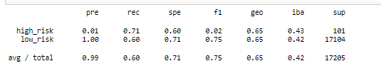
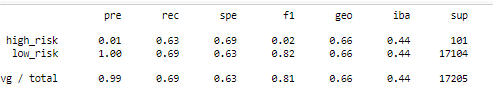
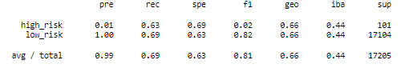
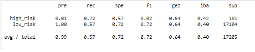
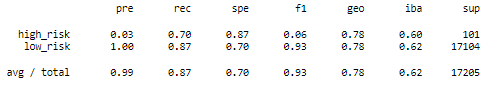
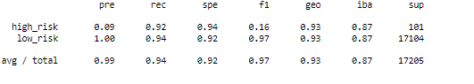

# Determining Credit Risk with Machine Learning

## Overview

In this module we were tasked with the implementation of machine learning models in order to determine credit risk on potential loans for a credit card company. Since credit
risk is a largely unbalanced classification, with good loans far outnumbering bad ones, we used several models to determine the likeliness to repay. These models, trained with
provided data, used oversampling, undersampling, or a combination of the two to determine a borrower’s likelihood to default on the loan. The results are as follows.

## Oversampling

We started with Naive Random Oversampling. The balanced accuracy score for this model was 0.657, indicating that the model is not entirely accurate, although somewhat reliable.
The average precision score is at 99%, with an average recall of 68%. The f1 score is is at 75%, indicating that about 75% of predictions are correct. 

Next, we used SMOTE Oversampling to better predict results. The balanced accuracy score of the SMOTE model was lower than the Naïve Random model, with on 0.662. The average
precision score of this model was comparable to the last, at 99%. Both the average recall and f1 score are higher in this model, at 69% and 81% respectively.

## Undersampling

We then switched methods, and looked at the precision of undersampling models, using Cluster Centroid technique. The balanced accuracy score of this model was also at 0.662. The
average precision was at 99%, recall was at 69%, and the f1 score was 81%. This model was comparable to the SMOTE Oversampling model. 

## Combination Sampling

Next, we switched methods again, using a combination of both over and undersampling in the SMOTEEN model. The balanced accuracy score was at .644, precision was at 99%, recall 
was low at 57%, along with the f1 score at 72%.

## Ensemble Learning Models

We then switched over to Ensemble Learning models, starting with Balanced Random Forest Classifiers. The balanced accuracy score of this model was notably higher than the
previous models, clocking in at 0.789. Precision was comparable at 0.99. Recall (87%) and f1 scores (93%) were also much higher than previous models. 

Finally, we looked at the Easy Ensemble AdaBoost Classifier model. This model had the highest balance accuracy score, 0.932. Precision was at 99%, recall was at 94%, and f1
scores were at 91%. 

## Summary

After looking at the six models, the Easy Ensemble AdaBoost Classifier is by far the most accurate. Across the board it had a higher balanced accuracy score, a higher f1 score,
and a higher recall score. This model will provide the company the accuracy needed to assess lending opportunities and maximize the amount of “good” loans.
